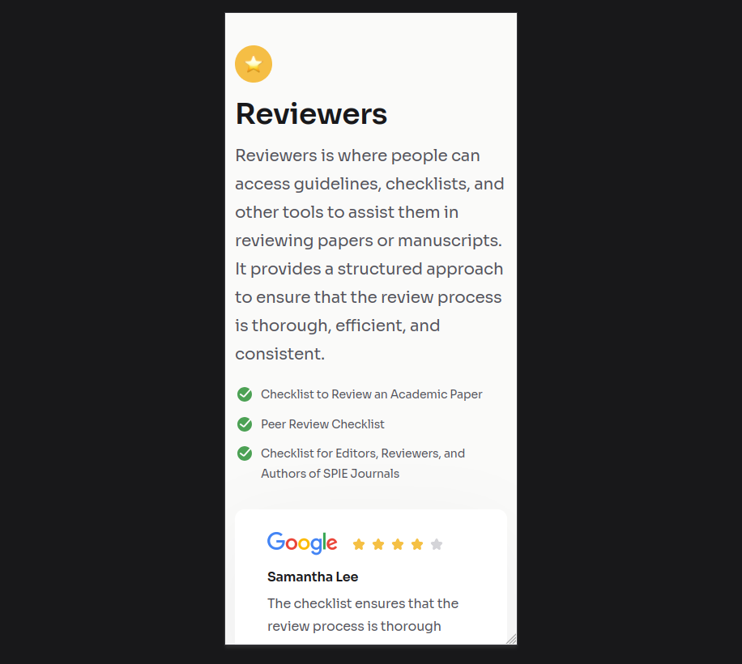
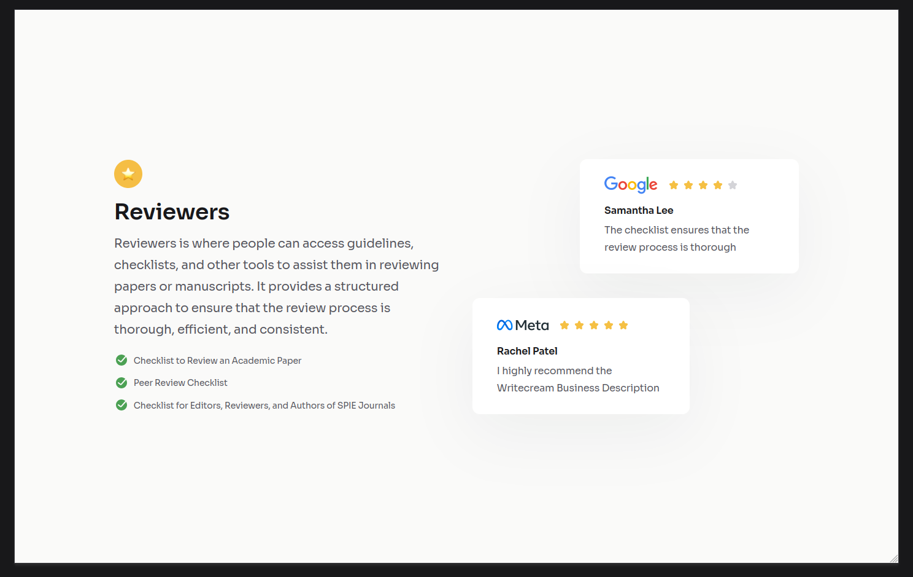

<!-- Please update value in the {}  -->

<h1 align="center">Testimonial Page | devChallenges</h1>

   Solution for a challenge <a href="https://devchallenges.io/challenge/testimonial-page" target="_blank">Testimonial Page</a> from <a href="http://devchallenges.io" target="_blank">devChallenges.io</a>.

  <h3>
    <a href="https://devamaruk.github.io/Testimonial-Page/">
      Demo
    </a>
     | 
    <a href="https://github.com/DevAmaruk/Testimonial-Page">
      Solution
    </a>
     | 
    <a href="https://devchallenges.io/challenge/testimonial-page">
      Challenge
    </a>
  </h3>

<!-- TABLE OF CONTENTS -->

## Table of Contents

- [Overview](#overview)
  - [Screenshots](#screenshots)
  - [What I learned](#what-i-learned)
  - [Useful resources](#useful-resources)
- [Built with](#built-with)
- [Author](#author)

<!-- OVERVIEW -->

## Overview

### Screenshots

Mobile

Tablet

Desktop

### What I learned

This project helped me improve my knowledge of **Flexbox** and **CSS Grid**, especially building a responsive layout that adapts from mobile to desktop.

### Useful resources

- [Flexbox Playground](https://devamaruk.github.io/Flexbox-Playground/) - A playground I built to practice and better understand Flexbox properties.
- [Grid Playground](https://devamaruk.github.io/Grid-Playground/) - Same idea for CSS Grid, very useful to visualize how the properties behave.
- [CSS Unit Converter](https://devamaruk.github.io/CSS-Unit-Converter/) - A tool to convert CSS units (px, rem, em, etc.).

### Built with

- Semantic HTML5 markup
- CSS custom properties
- Flexbox
- CSS Grid

## Author

- LinkedIn [jguthauser](https://www.linkedin.com/in/jguthauser/)
- GitHub [@DevAmaruk](https://github.com/DevAmaruk)
